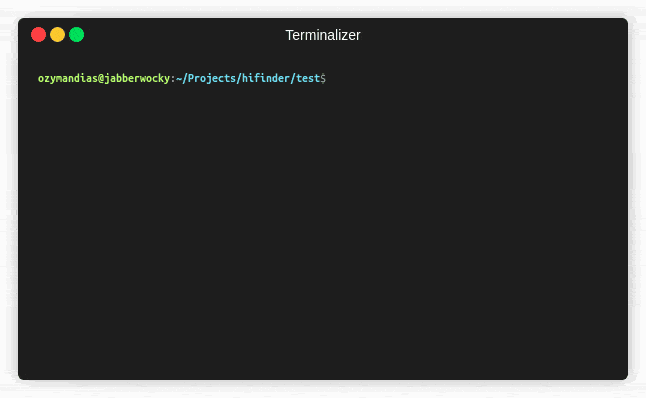

# hifinder

---------------------

If you find this app useful, consider becoming a [patron](https://www.patreon.com/ozymandias)

If you wish to make a one time donation, become a patron (you'll be charged) and immediately cancel your subscription.

---------------------

Perform reverse image search and automatically download highest available
resolution image. This script is powered by Google Reverse Image Search.

Be warned that execution takes a bit of time.
This is intentional as hitting Google too hard and fast triggers bot detection.



## Install

As `hifinder` is written in TypeScript, it needs Node to run.
You can get current version of Node [here](https://nodejs.org).

Additionally, `hifinder` uses Chrome/Chromium to render search result pages in the background.
If you don't already have it installed, you can get Chrome [here](https://www.google.com/chrome/).

Once you got dependencies set up, open command prompt/terminal emulator and run

```sh
npm intall --global hifinder
```

The above command might require administrator privileges, depending on how you installed Node.

## Usage

Download highest available resolution versions of all jpg images in current directory
to a subdirectory "HiRes" (default behavior):

```sh
hifinder *.jpg
```

Replace all png files with highest available resolution versions in current directory:

```sh
hifinder --dir . --keep-filename --overwrite *.png
```

For all available flags run:

```sh
hifinder --help
```
